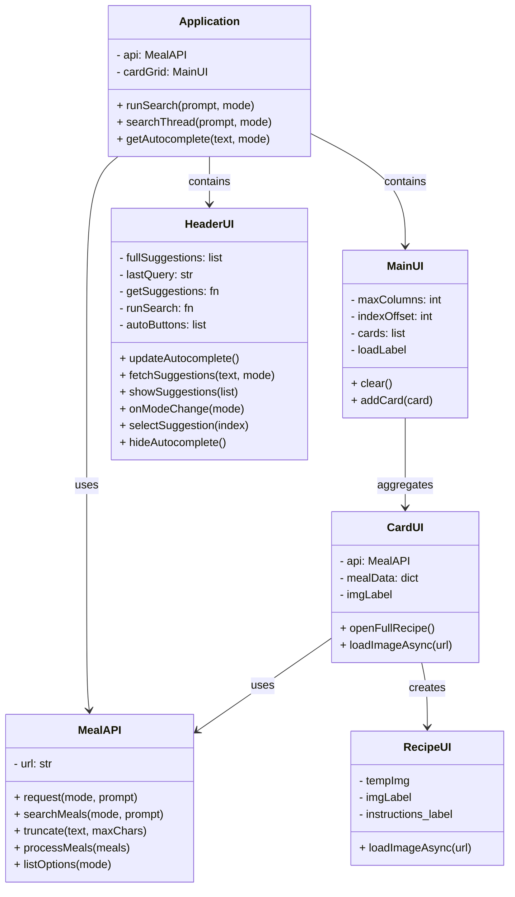

# Advanced Programming - Assessment 2

# Abstract
This project is a recipe viewer application using “TheMealDB” API. My application fetches user search queries from TheMealDB’s database to be used to display the recipes the user wants to view.

# Project Planning
The project plan goes as follows in their respective order:
- Make an API class with necessary functions/methods to fetch data
- Make a base user interface in web application style:
    - A header widget to contain the application name & search widgets
    - A main widget to contain all the clickable recipe cards
    - A separate window to display the recipe’s ingredients & instructions
- Make a backend for the application’s features and connect it to the API

The application should also run with optimizations in mind by running the API and backend code in the background. This will be explained further in later sections.
# Evidence of Design

## Application Wireframe

## UML Data Structure

# Technical Description & Walkthrough