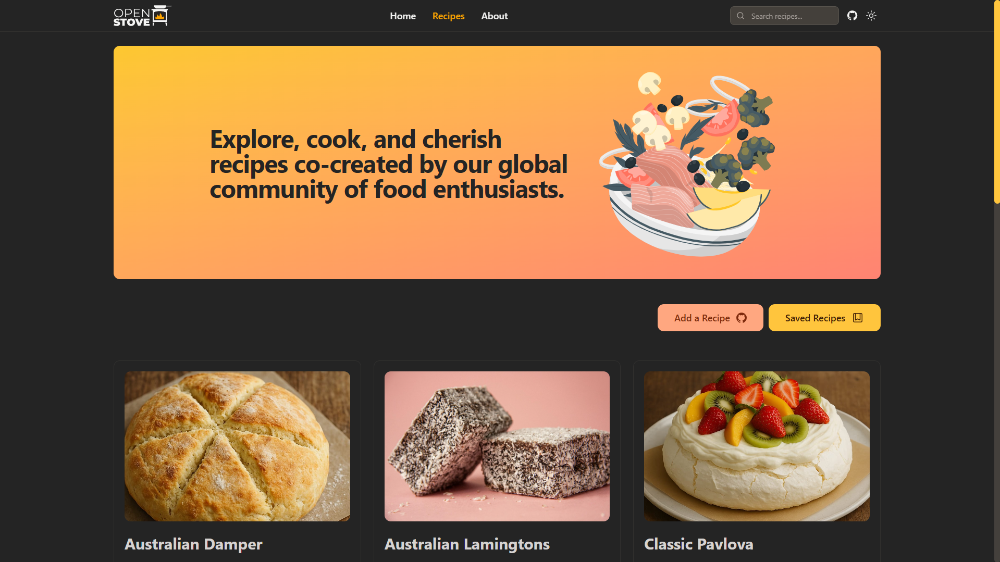
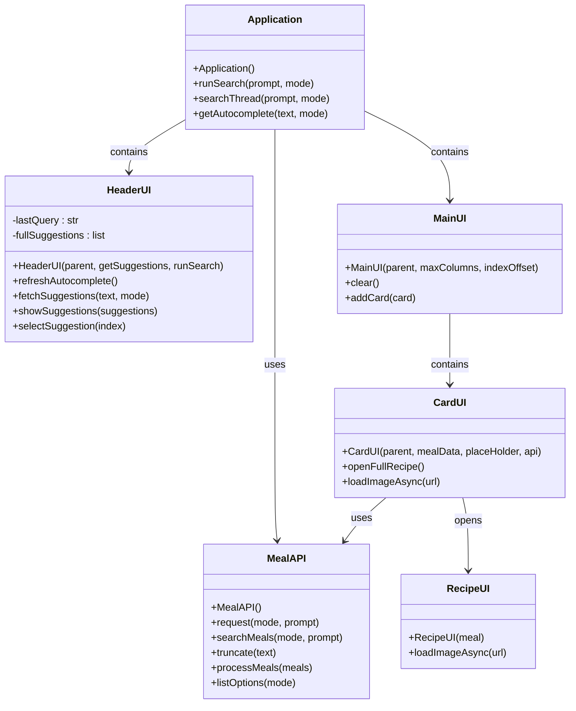

# Advanced Programming - Assessment 2
# Abstract
This "MEALY DISPLAYINATOR 3000" is a cooking recipe viewer application using “TheMealDB” API. The application fetches user search queries from TheMealDB’s database to be used to serve and display the recipes to the user.
# Project Planning
The project plan goes as follows in their respective order:
- Make an API class with necessary functions/methods to fetch data
- Make a base user interface in web application style:
    - A header widget to contain the application name and search widgets
    - A main widget to contain all the clickable recipe cards
    - A separate window to display the recipe’s ingredients and instructions
- Make a backend for the application’s features and connect it to the API

The application should also run with optimizations in mind by running the API and backend code in the background to improve user experience. This will be explained further in later sections.
# Evidence of Design
## Application Wireframe
MEALY DISPLAYINATOR 3000's layout is inspired by OpenStove.org, an open source web project for storing cooking recipes. The website can be found at: https://openstove.org/recipes

### Main App Window
The main app window displays the core elements similar to a traditional website: a header and a main element. The header element contains the application name and search widgets. The search widgets include a search entry, button, and type. The header will also contain a suggestion frame to contain the top 4 search results. The main element contains a label and a container containing all the recipe cards with each card storing an image of the meal, ID, and name.

### Top Level Window
The top level window, or the popup window will open when a recipe card is clicked. The top level window will contain 2 main sections: the prerequisites window and an instructions window. The prerequisites window will contain the meal's name, image, and the required ingredients. The instructions window will contain the instructions on how to prepare and cook the meal. Additionally the top level window will contain buttons to view the recipe's guide on YouTube and a close window button. The necessary contents will be provided by the API.

## UML Data Structure

# Technical Description and Walkthrough
MEALY DISPLAYINATOR 3000 uses Python 3.14.0 and the application uses the following packages:
- Requests : For requesting API data from TheMealDB
- Threading : For fetching API data in the background
- Webbrowser : For opening URL links
- PIL (Pillow) : For image widgets
- IO (I/O) : For converting data
- CustomTKinter : For UI display

The API this application uses has several dedicated methods that makes data management easier. This includes API requests, search prompts, and data processing for "cleaning" data. An API request starts with the API's URL and the prompt syntax according to the API's documentation. The search prompt simply translates the user's input into the API's URL prompt syntax. Data processing for "cleaning" or processing requested API data into a simpler format that the application can use.

The application takes advantage of the CustomTKinter package instead of TKinter. The reason for this design decision is because CustomTKinter is more flexible in changing styles and has more widget options than TKinter. The widget classes HeaderUI, MainUI, CardUI, and RecipeUI all inherit CustomTKinter's widgets to adapt it to CustomTKinter's environment. CustomTKinter uses pillow image objects from PIL package to display images through CTkLabel widgets, but since we're fetching image data from a URL link, the package IO is used to convert raw image data that PIL can use to turn it into a pillow image object.

As the main application class runs, it takes advantage of the Threading package to run the API requests in the background to load CustomTKinter's UI immediately upon application run. The user is met with a label asking the user to use the search bar to start searching for a meal by name, category, ingredient, or ID inside the option menu widget. As the user makes their prompt the suggestions frame starts populating with top 4 suggested search button options for the user. The user can either click on any of the suggested search options.

When the user runs their search prompt by pressing enter in the search bar, clicking on the search button, or clicking on any of the available suggested options, the MainUI widgets starts loading as the application fetches data from the API based on the user's search prompt. Once the application receives the data, the MainUI frame starts populating with CardUI widgets each containing the meal's image, ID, and name.

Each card stores the meal's full data. Clicking on a card passes the data to the top level window and opens the window as a popup to display the full meal data to the user. This includes the card's initial data, ingredients, instructions, and YouTube URL button which opens the user's browser using the Webbrowser package.
# Testing
The application has undergone several revisions up to version 5.0. The initial versions began with the initial layout of the widgets testing the responsive layout. The API is later added and used to connect to the widget's functions. The application is tested against its responsive functions in API and UI and error checking.
## Responsive UI
## Error Handling
## Optimization
# Critical Reflection
MEALY DISPLAYINATOR 3000 development has solidified my understanding of Object Oriented Programming. Making a API class helped me manage and organize my functions/methods and improved my abstract thinking. I learned how to create my own widget by inheriting CustomTKinter's available widgets to adapt to CustomTKinter's environment. This makes my workflow similar to how I write in HTML and manage design decisions easily.
# Appendix