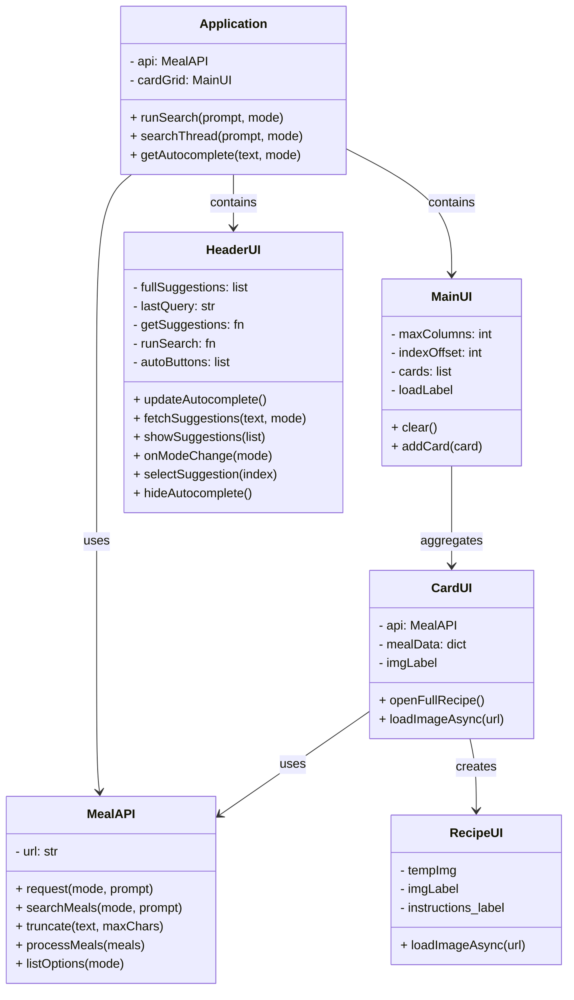

# Advanced Programming - Assessment 2
# Abstract
This "MEALY DISPLAYINATOR 3000" is a cooking recipe viewer application using “TheMealDB” API. The application fetches user search queries from TheMealDB’s database to be used to serve and display the recipes to the user.
# Project Planning
The project plan goes as follows in their respective order:
- Make an API class with necessary functions/methods to fetch data
- Make a base user interface in web application style:
    - A header widget to contain the application name and search widgets
    - A main widget to contain all the clickable recipe cards
    - A separate window to display the recipe’s ingredients and instructions
- Make a backend for the application’s features and connect it to the API

The application should also run with optimizations in mind by running the API and backend code in the background to improve user experience. This will be explained further in later sections.
# Evidence of Design
## Application Wireframe
MEALY DISPLAYINATOR 3000's layout is inspired by OpenStove.org, an open source web project for storing cooking recipes. The website can be found at: https://openstove.org/recipes

### Main App Window
The main app window displays the core elements similar to a traditional website: a header and a main element. The header element contains the application name and search widgets. The search widgets include a search entry, button, and type. The header will also contain a suggestion frame to contain the top 4 search results. The main element contains a label and a container containing all the recipe cards with each card storing an image of the meal, ID, and name.

### Top Level Window
The top level window, or the popup window will open when a recipe card is clicked. The top level window will contain 2 main sections: the prerequisites window and an instructions window. The prerequisites window will contain the meal's name, image, and the required ingredients. The instructions window will contain the instructions on how to prepare and cook the meal. Additionally the top level window will contain buttons to view the recipe's guide on YouTube and a close window button. The necessary contents will be provided by the API.

## UML Data Structure

# Technical Description and Walkthrough